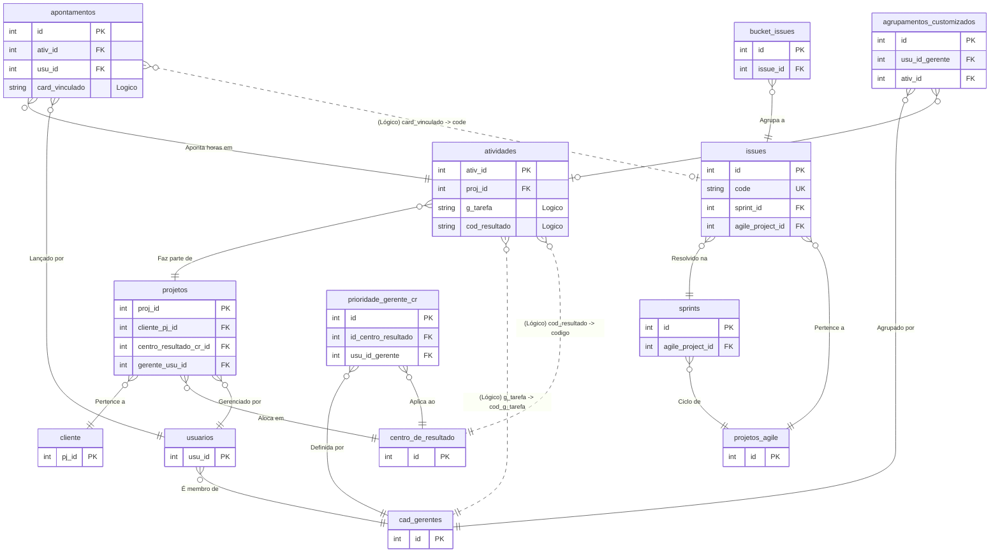

# Mapeamento de Rotas API e Tabela de Destino

| Sistema Origem | Endpoint | Tipo de Dados Extraídos | Tabela Destino no Banco |
| :--- | :--- | :--- | :--- |
| **PSOffice** | `/projetos/` | Projetos base e metadados estruturais | `projetos` |
| **PSOffice** | `/projetos/{id}/atividades/` | WBS (Atividades de projetos) | `atividades` |
| **PSOffice** | `/usuarios/` | Cadastro de Usuários Ativos/Inativos | `usuarios` |
| **PSOffice** | `/clientes/` | Cadastro de Clientes (PJ) | `cliente` |
| **PSOffice** | `/apontamento_horas/` | Horas lançadas dia a dia | `apontamentos` |
| **Agile (JExperts)** | `/projects/` | Projetos contextuais de Metodologia Ágil| `projetos_agile` |
| **Agile (JExperts)** | `/sprints/` | Ciclos iterativos de desenvolvimento | `sprints` |
| **Agile (JExperts)** | `/projects/{id}/issues/` | Cards consolidados, épicos e bugs | `issues` |
| **Agile (JExperts)** | `/projects/{id}/bucket-issues/`| Mapeamento de Issues para repositórios | `bucket_issues` |

---

## Diagrama de Banco de Dados

### Visualização do Relacionamento (Mermaid)

### Explicação dos Relacionamentos Lógicos Identificados
As ligações desenhadas como `pontilhadas` acima representam as uniões de Soft-Link solicitadas, que não possuem travas estruturais (Foreign Key dura no Postgres) para garantir estabilidade da sua API:

1. **Apontamentos -> Issues**: A coluna de texto `card_vinculado` de um apontamento liga-se logicamente à coluna `code` de uma Issue, permitindo saber indiretamente de qual requisição ágil aquelas horas pertencem.
2. **Atividades -> Cadastro de Gerentes**: A coluna gerada por RegExp `g_tarefa` correlaciona-se com `cod_g_tarefa` na tabela do respectivo gestor.
3. **Atividades -> Centro de Resultado**: A coluna gerada `cod_resultado` tem correlação direta com o `codigo` oficial da tabela Centro de Resultado.
